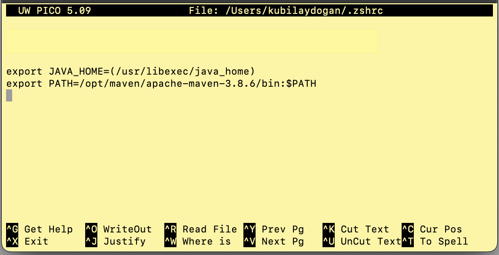

## **Install & Configure Maven**

- First create a directory and download maven into this directory

    > mkdir -p /opt/maven<br>
    > cd /opt/maven

- Download [apache-maven-3.8.6-bin.zip](https://maven.apache.org/download.cgi) and open it. Then

    > cd apache-maven-3.8.6 <br>
    > pwd

    (this is to get the path to maven) and copy the path: `/opt/maven/apache-maven-3.8.6`

- Set the MAVEN_HOME path

    > nano ~/.zshrc

    -  export PATH=/opt/maven/apache-maven-3.8.6/bin:$PATH

        </img>

    > source ~/.zshrc

- Verify: mvn -v

    ```
    Maven home: /opt/maven/apache-maven-3.8.6
    Java version: 17.0.5, vendor: Oracle Corporation, runtime: /Library/Java/JavaVirtualMachines/jdk-17.0.5.jdk/Contents/Home
    ```
<br><br>
