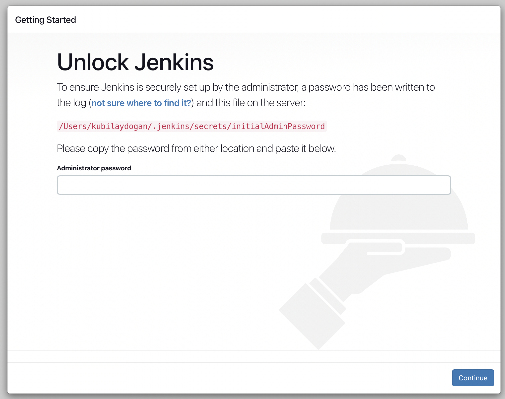
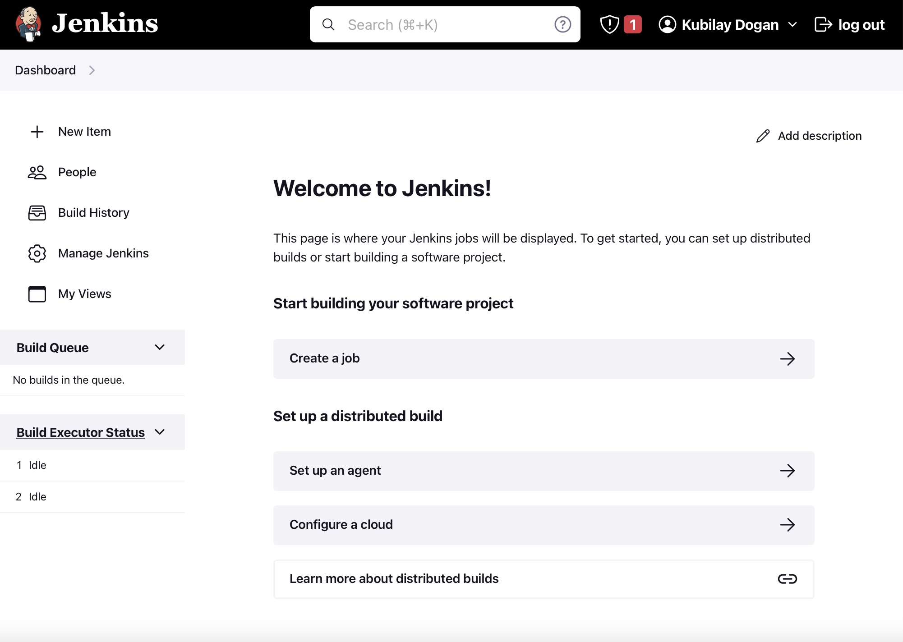
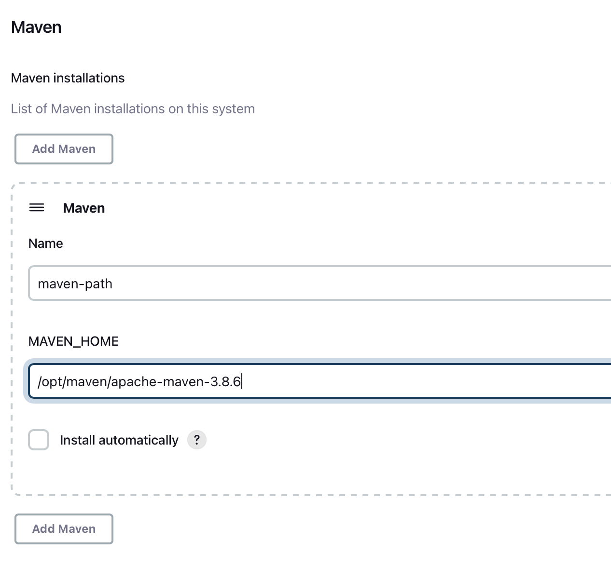
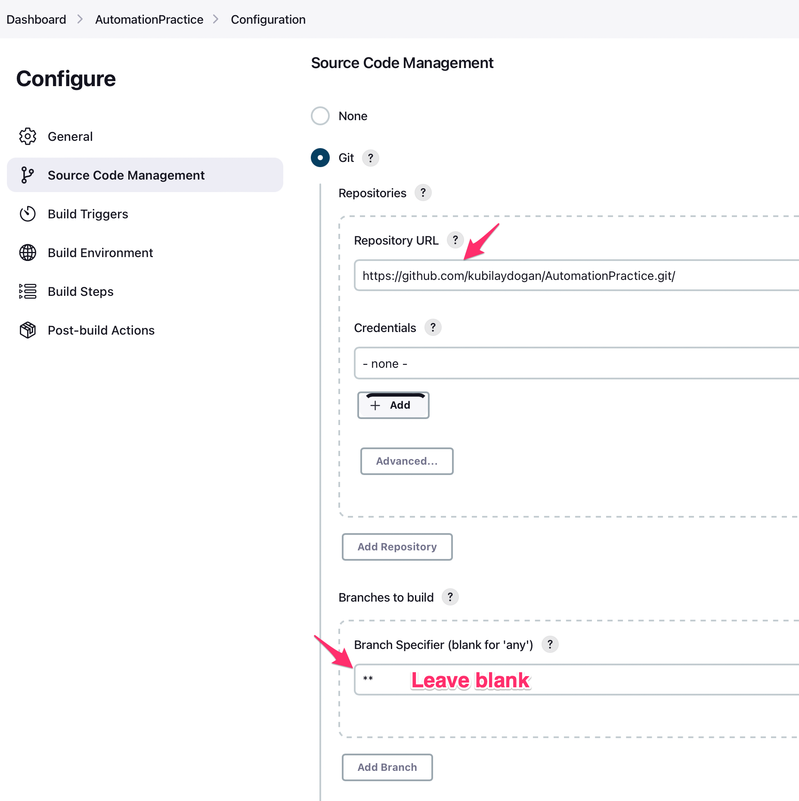
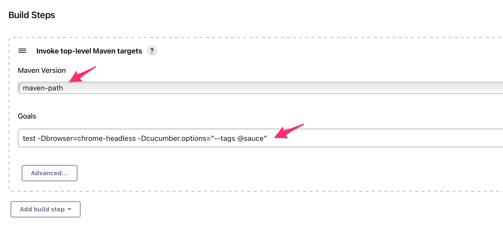
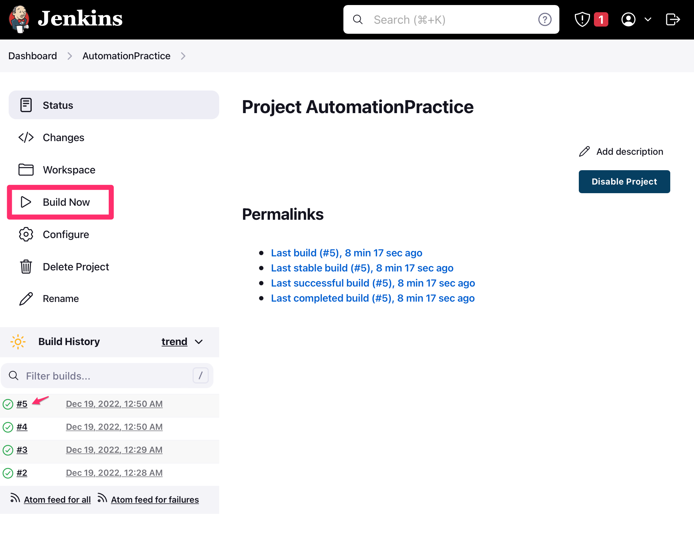

# Jenkins

## **Prerequisite**

- [Install Maven](Install_Maven.md)

- Download Jenkins

    > For Mac:   `brew install jenkins-lts`

    > For [Windows](https://www.jenkins.io/download/thank-you-downloading-windows-installer/)

 

## **Using Jenkins**

> Start the Jenkins service:  `brew services start jenkins-lts`

> After starting the Jenkins service, browse to  `http://localhost:8080`  and follow the instructions to complete the installation.

 

### **Unlock Jenkins**

When you access Jenkins for the first time, you are asked to unlock it using a secret initial admin password. 

</img>

> Enter in Terminal:  `pbcopbcopy < /Users/{your_username}/.jenkins/secrets/initialAdminPassword`  and paste the password

After you will create the first administrator user.

When done, you will be navigated to dashboard:

</img>

  

## **Install & Configure Maven Build Tool On Jenkins**

The reason behind integrating Maven with Jenkins is so that we can execute Maven commands through Jenkins as we will majorly use Maven for Java projects. 

Manage Jenkins ➡️ Global Tool Configuration ➡️ Click **Add Maven** ➡️ Uncheck **Install automatically** ➡️ Add a parameter and enter the path. 

</img>

 

## **Notes**
> To stop the Jenkins server:  `brew services stop jenkins-lts`

> Restart the Jenkins service:  `brew services restart jenkins-lts`

>Update the Jenkins version:  `brew upgrade jenkins-lts`

  

----
## **`Create a simple Freestyle Project`**
----
Dashboard ➡️ New Item ➡️ Select **Freestyle Project**

Enter repo url and define branch:
</img>

Enter the maven_path parameter you created before and your mvn command to run the tests.

</img>

After saving, you can run your tests by clicking the `Build Now` button.

</img>